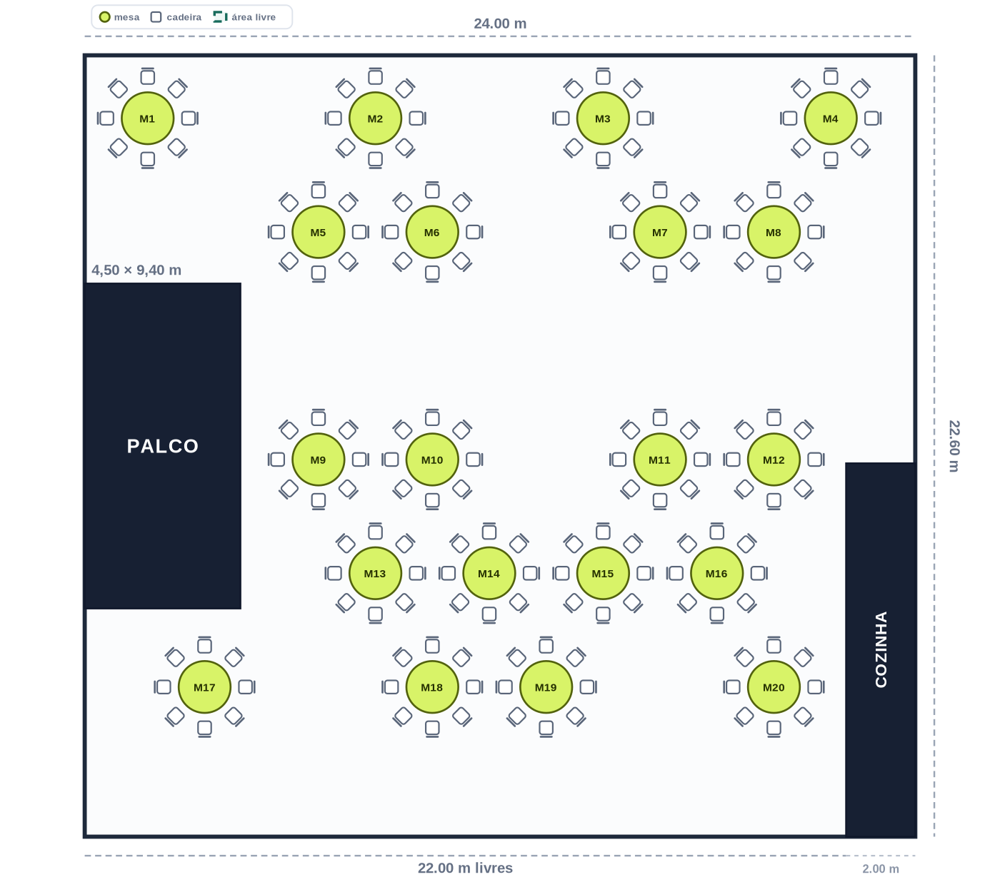

# PlanejaSalão — v1.1

Aplicativo web para calcular a área do salão, distribuir mesas e cadeiras e gerar propostas de montagem para apresentar aos clientes.



## Medidas configuradas

- Largura total do salão: **24,00 m**
- Largura livre até o início da cozinha: **22,00 m**
- Comprimento: **22,60 m**
- Palco: **4,50 × 9,40 m**
- Cozinha: largura calculada de **2,00 m** e profundidade inicial de **10,80 m**

## Recursos

- Mesas redondas ou retangulares.
- Quantidade de mesas e cadeiras configurável.
- Cadeiras por mesa e distância de circulação configuráveis.
- Cálculo da área bruta, área útil e ocupação aproximada.
- Bloqueio automático do palco e da cozinha.
- Quatro padrões de montagem:
  - Banquete equilibrado
  - Corredor central
  - Pista central
  - Palco em foco
- Avisos quando mesas ou cadeiras não cabem.
- Exportação da planta em PNG.
- Impressão profissional e salvamento em PDF pelo navegador.
- Salvamento automático no navegador.
- Importação e exportação do projeto em JSON.

## Abrir no computador

Este projeto não precisa de instalação nem de `npm`.

Basta abrir o arquivo `index.html` no navegador. Para testar com um servidor local, também é possível usar:

```bash
python -m http.server 8000
```

Depois abra `http://localhost:8000`.

## Publicar no GitHub

1. Crie um repositório vazio.
2. Envie os arquivos desta pasta.
3. Faça o commit e o push.

O projeto possui poucos arquivos e está pronto para versionamento.

## Publicar na Vercel

1. Entre na Vercel e clique em **Add New > Project**.
2. Importe o repositório do GitHub.
3. Em **Framework Preset**, selecione **Other**.
4. Não informe comando de build.
5. Não altere o diretório de saída.
6. Clique em **Deploy**.

## Observação técnica

A planta foi corrigida para um retângulo de 24,00 × 22,60 m. A medida de 22,00 m foi interpretada como o espaço livre até a cozinha, portanto a cozinha ocupa os 2,00 m restantes na lateral direita. A profundidade da cozinha permanece editável na barra lateral.

Antes de usar uma planta em um evento real, confirme portas, saídas de emergência, extintores, acessibilidade e exigências do AVCB.
